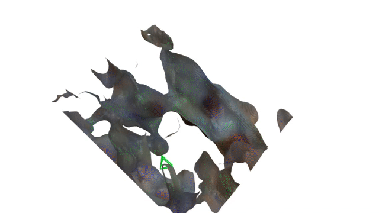

## Dense SLAM with an Implicit Neural Representation

This project has been implemented during my Master's course in Computer Graphics, Vision and Imaging at UCL. It is basically an implementation of a great paper by Sucar et al., <a href="https://edgarsucar.github.io/iMAP/">iMap</a>, with some minor modifications. <a href="https://vision.in.tum.de/data/datasets/rgbd-dataset">TUM</a> and <a href="https://www.doc.ic.ac.uk/~ahanda/VaFRIC/iclnuim.html">ICL-NUIM</a> sequences have been used for benchmarking and evaluation of reconstruction quality.
  
<strike>The project can be easily run on .</strike>
An issue has been reported when running on Tensorflow 2.7. There is no (easy) way to downgrade Tensorflow on Colab so it might not work there. Please follow the Tensorflow version provided in <code>requirements.txt</code>.